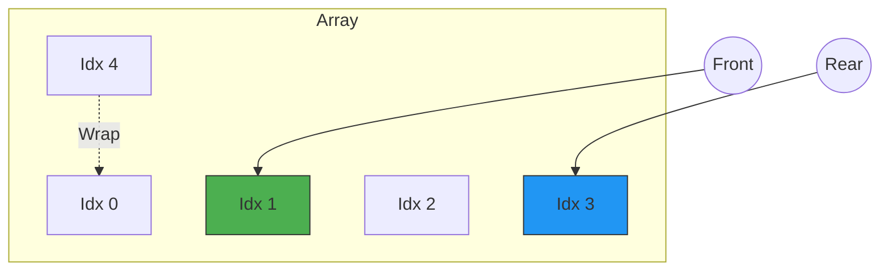

# Design Circular Deque

## 🧩 Problem Statement
Design your implementation of the circular double-ended queue (deque).

Implement the `MyCircularDeque` class:
- `MyCircularDeque(int k)` Initializes the deque with a maximum size of `k`.
- `boolean insertFront()` Adds an item at the front of Deque. Returns `true` if the operation is successful, or `false` otherwise.
- `boolean insertLast()` Adds an item at the rear of Deque. Returns `true` if the operation is successful, or `false` otherwise.
- `boolean deleteFront()` Deletes an item from the front of Deque. Returns `true` if the operation is successful, or `false` otherwise.
- `boolean deleteLast()` Deletes an item from the rear of Deque. Returns `true` if the operation is successful, or `false` otherwise.
- `int getFront()` Returns the front item from the Deque. Returns `-1` if the deque is empty.
- `int getRear()` Returns the last item from Deque. Returns `-1` if the deque is empty.
- `boolean isEmpty()` Returns `true` if the deque is empty, or `false` otherwise.
- `boolean isFull()` Returns `true` if the deque is full, or `false` otherwise.

## 🔍 Approaches

### 1. Fixed Array with Modulo Arithmetic ($O(1)$)
- **Concept:** Use an array of size `k` (or `k+1` to distinguish full/empty if not tracking size). Tracking `size` explicitly is easier.
- **Structure:** 
  - `vector/array`: Stores elements.
  - `front`: Index of the front element.
  - `rear`: Index of the **next available** rear position (or last actual element, careful with off-by-one). Let's use `rear` points to last element.
  - `size`: Current number of elements.
- **Operations:**
  - `insertFront(val)`: Decrement `front` cyclically: `front = (front - 1 + k) % k`.
  - `insertLast(val)`: Increment `rear` cyclically: `rear = (rear + 1) % k`.
  - `deleteFront()`: Increment `front`.
  - `deleteLast()`: Decrement `rear`.
  - **Handling Empty/Full:** Check `size` vs `k`.

### 🏛️ Design Diagram

*Example: capacity=5. `Front` is at 1, `Rear` is at 3. Elements at [1, 2, 3].*

## ⏳ Time & Space Complexity
- **Time Complexity:** $O(1)$ for all operations.
- **Space Complexity:** $O(K)$ pre-allocated array.

## 🚀 Code Implementations

### C++
```cpp
#include <vector>
#include <iostream>

using namespace std;

class MyCircularDeque {
    vector<int> buffer;
    int k;
    int front; // Points to current front
    int rear;  // Points to current rear
    int count; // To track size

public:
    MyCircularDeque(int k) {
        this->k = k;
        buffer.resize(k);
        front = 0;
        rear = k - 1; // Start rear "behind" front effectively
        count = 0;
    }
    
    bool insertFront(int value) {
        if (isFull()) return false;
        front = (front - 1 + k) % k;
        buffer[front] = value;
        count++;
        // If this was the first element, rear needs to align?
        // With rear initialized to k-1, if we insertFront:
        // front becomes k-1. buffer[k-1] = val.
        // real rear is also k-1.
        // Strategy: 
        // Let's adopt: Rear points to the last VALID element.
        // Front points to the first VALID element.
        // Init: front = 0, rear = k - 1.
        // First insertFront: front -> k-1. buf[k-1]=v. count=1.
        // if we called getRear(), it returns buf[k-1]. Correct.
        // First insertLast: rear = (k-1 + 1)%k = 0. buf[0]=v.
        // getFront() returns buf[0]. Correct.
        return true;
    }
    
    bool insertLast(int value) {
        if (isFull()) return false;
        rear = (rear + 1) % k;
        buffer[rear] = value;
        count++;
        return true;
    }
    
    bool deleteFront() {
        if (isEmpty()) return false;
        front = (front + 1) % k;
        count--;
        return true;
    }
    
    bool deleteLast() {
        if (isEmpty()) return false;
        rear = (rear - 1 + k) % k;
        count--;
        return true;
    }
    
    int getFront() {
        if (isEmpty()) return -1;
        return buffer[front];
    }
    
    int getRear() {
        if (isEmpty()) return -1;
        return buffer[rear];
    }
    
    bool isEmpty() {
        return count == 0;
    }
    
    bool isFull() {
        return count == k;
    }
};
```

### Python
```python
class MyCircularDeque:

    def __init__(self, k: int):
        self.k = k
        self.buffer = [0] * k
        self.count = 0
        self.front = 0
        self.rear = k - 1

    def insertFront(self, value: int) -> bool:
        if self.isFull(): return False
        self.front = (self.front - 1 + self.k) % self.k
        self.buffer[self.front] = value
        self.count += 1
        return True

    def insertLast(self, value: int) -> bool:
        if self.isFull(): return False
        self.rear = (self.rear + 1) % self.k
        self.buffer[self.rear] = value
        self.count += 1
        return True

    def deleteFront(self) -> bool:
        if self.isEmpty(): return False
        self.front = (self.front + 1) % self.k
        self.count -= 1
        return True

    def deleteLast(self) -> bool:
        if self.isEmpty(): return False
        self.rear = (self.rear - 1 + self.k) % self.k
        self.count -= 1
        return True

    def getFront(self) -> int:
        return -1 if self.isEmpty() else self.buffer[self.front]

    def getRear(self) -> int:
        return -1 if self.isEmpty() else self.buffer[self.rear]

    def isEmpty(self) -> bool:
        return self.count == 0

    def isFull(self) -> bool:
        return self.count == self.k
```

### Java
```java
class MyCircularDeque {
    private int[] buffer;
    private int k, front, rear, count;

    public MyCircularDeque(int k) {
        this.k = k;
        this.buffer = new int[k];
        this.front = 0;
        this.rear = k - 1;
        this.count = 0;
    }
    
    public boolean insertFront(int value) {
        if (isFull()) return false;
        front = (front - 1 + k) % k;
        buffer[front] = value;
        count++;
        return true;
    }
    
    public boolean insertLast(int value) {
        if (isFull()) return false;
        rear = (rear + 1) % k;
        buffer[rear] = value;
        count++;
        return true;
    }
    
    public boolean deleteFront() {
        if (isEmpty()) return false;
        front = (front + 1) % k;
        count--;
        return true;
    }
    
    public boolean deleteLast() {
        if (isEmpty()) return false;
        rear = (rear - 1 + k) % k;
        count--;
        return true;
    }
    
    public int getFront() {
        if (isEmpty()) return -1;
        return buffer[front];
    }
    
    public int getRear() {
        if (isEmpty()) return -1;
        return buffer[rear];
    }
    
    public boolean isEmpty() {
        return count == 0;
    }
    
    public boolean isFull() {
        return count == k;
    }
}
```

## 🌍 Real-World Analogy
### **Lazy Susan Table:**
Imagine a round rotating table (Lazy Susan) with 5 numbered slots. You can place a dish in the slot to the "left" of the current group (Front) or to the "right" (Rear). Because it's a circle, index 0 is next to index 4.

## 🎯 Summary
✅ **Modulo Arithmetic:** The core logic `(index + 1) % k` and `(index - 1 + k) % k` handles the wrapping perfectly without needing to shift elements.
