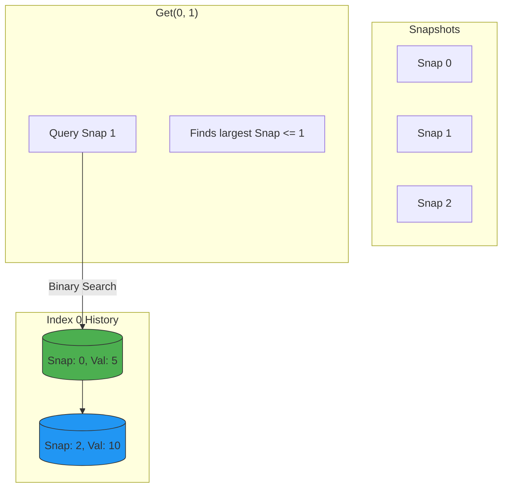

# Snapshot Array

## 🧩 Problem Statement
Implement a SnapshotArray that supports the following interface:

- `SnapshotArray(int length)` initializes an array-like data structure with the given length.  Initially, each element equals 0.
- `void set(index, val)` sets the element at the given `index` to be equal to `val`.
- `int snap()` takes a snapshot of the array and returns the `snap_id`: the total number of times we called `snap()` minus 1.
- `int get(index, snap_id)` returns the value at the given `index`, at the time we took the snapshot with the given `snap_id`

## 🔍 Approaches

### 1. Vector of Maps / List of Lists ($O(\log S)$)
- **Concept:** Instead of copying the whole array on every snapshot (which would be $O(N)$ space/time per snap), we only store changes.
- **Structure:** 
  - A list of lists/maps called `history`.
  - `history[i]` stores a list of pairs `(snap_id, value)` for index `i`.
  - `snap_id` is a global counter.
- **Operations:**
  - `set(index, val)`: Append `(current_snap_id, val)` to `history[index]`. If the last entry already has `current_snap_id`, update it instead of appending (overwrite within same snapshot).
  - `snap()`: Increment `global_snap_id`. Return `old_snap_id`.
  - `get(index, snap_id)`: Perform **Binary Search** (specifically `upper_bound` - 1) on `history[index]` to find the latest record where `recorded_snap_id <= requested_snap_id`.
- **Note:** Initial state is 0. We can either pre-fill `(0, 0)` or handle empty cases.

### 🏛️ Design Diagram


## ⏳ Time & Space Complexity
- **Time Complexity:**
  - `set`: $O(1)$ (amortized) or $O(\log S)$ if using map. List append is $O(1)$.
  - `snap`: $O(1)$.
  - `get`: $O(\log S)$ where $S$ is number of updates to that specific index.
- **Space Complexity:** $O(S)$ total updates.

## 🚀 Code Implementations

### C++
```cpp
#include <vector>
#include <map>
#include <algorithm>
#include <iostream>

using namespace std;

class SnapshotArray {
    // Index -> Vector of <SnapId, Value>
    vector<vector<pair<int, int>>> history;
    int snapId;
public:
    SnapshotArray(int length) {
        history.resize(length);
        for(int i=0; i<length; ++i) {
            history[i].push_back({0, 0});
        }
        snapId = 0;
    }
    
    void set(int index, int val) {
        // If we already have an entry for current snapId, update it
        if (history[index].back().first == snapId) {
            history[index].back().second = val;
        } else {
            history[index].push_back({snapId, val});
        }
    }
    
    int snap() {
        return snapId++;
    }
    
    int get(int index, int snap_id) {
        // Upper bound gives first element > snap_id
        // We want last element <= snap_id.
        // So we look for pair {snap_id + 1, MIN} and go back one.
        auto it = upper_bound(history[index].begin(), history[index].end(), make_pair(snap_id, 2000000000));
        return prev(it)->second;
    }
};
```

### Python
```python
import bisect

class SnapshotArray:

    def __init__(self, length: int):
        # List of [snap_id, value] lists
        self.history = [[(0, 0)] for _ in range(length)]
        self.snap_id = 0

    def set(self, index: int, val: int) -> None:
        if self.history[index][-1][0] == self.snap_id:
            self.history[index][-1] = (self.snap_id, val)
        else:
            self.history[index].append((self.snap_id, val))

    def snap(self) -> int:
        self.snap_id += 1
        return self.snap_id - 1

    def get(self, index: int, snap_id: int) -> int:
        # bisect_right returns insertion point after (snap_id, inf)
        # Essentially finding the first element > snap_id
        # We want the one before that.
        # We can search for (snap_id + 1, -1) effectively?
        # Actually bisect on list of tuples compares index 0 first.
        # Searching for (snap_id + 1,) is safe.
        idx = bisect.bisect_right(self.history[index], (snap_id, float('inf')))
        return self.history[index][idx - 1][1]
```

### Java
```java
import java.util.ArrayList;
import java.util.List;
import java.util.TreeMap;

class SnapshotArray {
    // Instead of Binary Search on List, TreeMap provides floorEntry efficiently.
    // List<TreeMap<SnapId, Value>>
    List<TreeMap<Integer, Integer>> history;
    int snapId;

    public SnapshotArray(int length) {
        history = new ArrayList<>();
        for (int i = 0; i < length; i++) {
            TreeMap<Integer, Integer> map = new TreeMap<>();
            map.put(0, 0);
            history.add(map);
        }
        snapId = 0;
    }
    
    public void set(int index, int val) {
        history.get(index).put(snapId, val);
    }
    
    public int snap() {
        return snapId++;
    }
    
    public int get(int index, int snap_id) {
        return history.get(index).floorEntry(snap_id).getValue();
    }
}
```

## 🌍 Real-World Analogy
### **Git Commit History:**
Every time you commit (`snap`), you save the state of your project. If you modify a specific file (`set`), that change is associated with the current commit ID. To see what a file looked like in the past (`get`), you assume it's unchanged from previous commits unless there's a specific record of it being modified at or before that commit ID.

## 🎯 Summary
✅ **Sparse Storage:** We only store differences.
✅ **Binary Search:** Allows efficient retrieval from the timeline.
