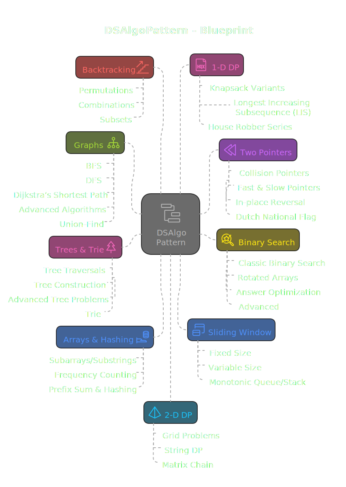

# DSAlgoPatterns - *DSA Pattern-Based Learning Repository*

Welcome to **DSAlgoPatterns**, a structured collection of **Data Structures and Algorithms (DSA) problems** designed to help you build problem-solving intuition across **C++, Python, and Java**.

Each topic follows a **pattern-based approach**, ensuring you recognize and apply solutions effectively. Every problem includes:
- **Solutions in C++, Python, and Java**
- **An explanation (`.md` file) for clarity**
- **Key concepts and approaches**

  

This repository is built to be a **self-sustained learning resource**, whether you're preparing for coding interviews, competitive programming, or improving problem-solving skills.

> 🟢 Beginner | 🟡 Intermediate | 🔴 Advanced

## 📂 Repository Blueprint

### Arrays & Hashing
- **Subarrays/Substrings** 🟡
  - [Maximum Subarray (Kadane's)](Arrays%20%26%20Hashing/Subarrays/Substrings/Maximum%20Subarray%20%28Kadane%27s%29) 🟢
  - [Minimum Window Substring](Arrays%20%26%20Hashing/Subarrays/Substrings/Minimum%20Window%20Substring) 🔴
  - [Longest Substring Without Repeating](Arrays%20%26%20Hashing/Subarrays/Substrings/Longest%20Substring%20Without%20Repeating) 🟡
- **Frequency Counting** 🟢
  - [Two Sum](Arrays%20%26%20Hashing/Frequency%20Counting/Two%20Sum) 🟢
  - [Two Sum II (Input Sorted)](Arrays%20%26%20Hashing/Frequency%20Counting/Two%20Sum%20II%20%28Input%20Sorted%29) 🟢
  - [Group Anagrams](Arrays%20%26%20Hashing/Frequency%20Counting/Group%20Anagrams) 🟡
  - [Top K Frequent Elements](Arrays%20%26%20Hashing/Frequency%20Counting/Top%20K%20Frequent%20Elements) 🟡
- **Prefix Sum & Hashing** 🟡
  - [Find Middle Index in Array](Arrays%20%26%20Hashing/Prefix%20Sum%20%26%20Hashing/Find%20Middle%20Index%20in%20Array) 🟢
  - [Product Except Self](Arrays%20%26%20Hashing/Prefix%20Sum%20%26%20Hashing/Product%20Except%20Self) 🟡
  - [Maximum Product Subarray](Arrays%20%26%20Hashing/Prefix%20Sum%20%26%20Hashing/Maximum%20Product%20Subarray) 🟡
  - [Number of Ways to Split Array](Arrays%20%26%20Hashing/Prefix%20Sum%20%26%20Hashing/Number%20of%20Ways%20to%20Split%20Array) 🟡
  - [Range Sum Query 2D](Arrays%20%26%20Hashing/Prefix%20Sum%20%26%20Hashing/Range%20Sum%20Query%202D) 🟡

### Two Pointers
- **Collision Pointers** 🟡
  - [Container with Most Water](Two%20Pointers/Collision%20Pointers/Container%20with%20Most%20Water) 🟡
  - [Trapping Rain Water](Two%20Pointers/Collision%20Pointers/Trapping%20Rain%20Water) 🔴
  - [3Sum](Two%20Pointers/Collision%20Pointers/3Sum) 🟡
- **Fast & Slow Pointers** 🟡
  - [Linked List Cycle II](Two%20Pointers/Fast%20%26%20Slow%20Pointers/Linked%20List%20Cycle%20II) 🟡
  - [Remove Nth Node from End](Two%20Pointers/Fast%20%26%20Slow%20Pointers/Remove%20Nth%20Node%20from%20End) 🟡
  - [Find the Duplicate Number](Two%20Pointers/Fast%20%26%20Slow%20Pointers/Find%20the%20Duplicate%20Number) 🟡
  - [Palindrome Linked List](Two%20Pointers/Fast%20%26%20Slow%20Pointers/Palindrome%20Linked%20List) 🟢
- **In-place Reversal** 🟡
  - [Reverse Linked List](Two%20Pointers/In-place%20Reversal/Reverse%20Linked%20List) 🟢
  - [Reverse Nodes in k-Group](Two%20Pointers/In-place%20Reversal/Reverse%20Nodes%20in%20k-Group) 🔴
  - [Swap Nodes in Pairs](Two%20Pointers/In-place%20Reversal/Swap%20Nodes%20in%20Pairs) 🟡
  - [Rotate Array](Two%20Pointers/In-place%20Reversal/Rotate%20Array) 🟡
- **Dutch National Flag** 🟡
  - [Sort Colors](Two%20Pointers/Dutch%20National%20Flag/Sort%20Colors) 🟡

### Binary Search
- **Classic Binary Search** 🟢
  - [Find Target in Sorted Array](Binary%20Search/Classic%20Binary%20Search/Find%20Target%20in%20Sorted%20Array) 🟢
  - [Search Insert Position](Binary%20Search/Classic%20Binary%20Search/Search%20Insert%20Position) 🟢
- **Rotated Arrays** 🟡
  - [Find Minimum in Rotated Sorted Array](Binary%20Search/Rotated%20Arrays/Find%20Minimum%20in%20Rotated%20Sorted%20Array) 🟡
  - [Search in Rotated Sorted Array](Binary%20Search/Rotated%20Arrays/Search%20in%20Rotated%20Sorted%20Array) 🟡
- **Answer Optimization** 🟡
  - [Capacity to Ship Packages](Binary%20Search/Answer%20Optimization/Capacity%20to%20Ship%20Packages) 🟡
  - [Koko Eating Bananas](Binary%20Search/Answer%20Optimization/Koko%20Eating%20Bananas) 🟡
  - [Split Array Largest Sum](Binary%20Search/Answer%20Optimization/Split%20Array%20Largest%20Sum) 🔴
- **Advanced** 🔴
  - [Single Element in Sorted Array](Binary%20Search/Advanced/Single%20Element%20in%20Sorted%20Array) 🟡
  - [Find in Mountain Array](Binary%20Search/Advanced/Find%20in%20Mountain%20Array) 🔴
  - [Median of Two Sorted Arrays](Binary%20Search/Advanced/Median%20of%20Two%20Sorted%20Arrays) 🔴

### Sliding Window
- **Fixed Size** 🟡
  - [Maximum Sum Subarray of Size K](Sliding%20Window/Fixed%20Size/Maximum%20Sum%20Subarray%20of%20Size%20K) 🟢
  - [Permutation in String](Sliding%20Window/Fixed%20Size/Permutation%20in%20String) 🟡
  - [Repeated DNA Sequences](Sliding%20Window/Fixed%20Size/Repeated%20DNA%20Sequences) 🟡
  - [Sliding Subarray Beauty](Sliding%20Window/Fixed%20Size/Sliding%20Subarray%20Beauty) 🟡
- **Variable Size** 🟡
  - [Longest Substring Without Repeating](Sliding%20Window/Variable%20Size/Longest%20Substring%20Without%20Repeating) 🟡
  - [Minimum Size Subarray Sum](Sliding%20Window/Variable%20Size/Minimum%20Size%20Subarray%20Sum) 🟡
  - [Count Number of Nice Subarrays](Sliding%20Window/Variable%20Size/Count%20Number%20of%20Nice%20Subarrays) 🟡
  - [Longest Repeating Character Replacement](Sliding%20Window/Variable%20Size/Longest%20Repeating%20Character%20Replacement) 🟡
- **Monotonic Queue/Stack** 🔴
  - [Sliding Window Maximum](Sliding%20Window/Monotonic%20Queue/Stack/Sliding%20Window%20Maximum) 🔴
  - [Longest Continuous Subarray (Absolute Diff)](Sliding%20Window/Monotonic%20Queue/Stack/Longest%20Continuous%20Subarray%20%28Absolute%20Diff%29) 🟡

### Backtracking
- **Permutations** 🟡
  - [Permutations I & II](Backtracking/Permutations/Permutations%20I%20%26%20II) 🟡
  - [N-Queens](Backtracking/Permutations/N-Queens) 🔴
  - [Sudoku Solver](Backtracking/Permutations/Sudoku%20Solver) 🔴
- **Combinations** 🟡
  - [Combination Sum I & II](Backtracking/Combinations/Combination%20Sum%20I%20%26%20II) 🟡
  - [Generate Parentheses](Backtracking/Combinations/Generate%20Parentheses) 🟡
- **Subsets** 🟡
  - [Subsets I & II](Backtracking/Subsets/Subsets%20I%20%26%20II) 🟡
  - [Palindrome Partitioning](Backtracking/Subsets/Palindrome%20Partitioning) 🟡
  - [Word Search](Backtracking/Subsets/Word%20Search) 🟡

### Graphs
- **BFS** 🟡
  - [Shortest Path in Binary Matrix](Graphs/BFS/Shortest%20Path%20in%20Binary%20Matrix) 🟡
  - [Rotten Oranges](Graphs/BFS/Rotten%20Oranges) 🟡
  - [As Far From Land as Possible](Graphs/BFS/As%20Far%20From%20Land%20as%20Possible) 🟡
  - [Word Ladder](Graphs/BFS/Word%20Ladder) 🔴
- **DFS** 🟡
  - [Number of Islands](Graphs/DFS/Number%20of%20Islands) 🟡
  - [Number of Closed Islands](Graphs/DFS/Number%20of%20Closed%20Islands) 🟡
  - [Coloring a Border](Graphs/DFS/Coloring%20a%20Border) 🟡
  - [Number of Enclaves](Graphs/DFS/Number%20of%20Enclaves) 🟡
  - [Time Needed to Inform All Employees](Graphs/DFS/Time%20Needed%20to%20Inform%20All%20Employees) 🟡
- **Advanced Algorithms** 🔴
  - [Dijkstra's Shortest Path](Graphs/Advanced%20Algorithms/Dijkstra%27s%20Shortest%20Path) 🔴
  - [Topological Sort](Graphs/Advanced%20Algorithms/Topological%20Sort) 🔴
  - [Kruskal's (Union-Find)](Graphs/Advanced%20Algorithms/Kruskal%27s) 🔴
- **Union-Find** 🟡
  - [Redundant Connection](Graphs/Union-Find/Redundant%20Connection) 🟡
  - [Number of Provinces](Graphs/Union-Find/Number%20of%20Provinces) 🟡
  - [Accounts Merge](Graphs/Union-Find/Accounts%20Merge) 🟡

### 1-D DP
- **Knapsack Variants** 🟡
  - [Subset Sum](1-D%20DP/Knapsack%20Variants/Subset%20Sum) 🟡
  - [Coin Change](1-D%20DP/Knapsack%20Variants/Coin%20Change) 🟡
  - [Target Sum](1-D%20DP/Knapsack%20Variants/Target%20Sum) 🟡
  - [Partition Equal Subset Sum](1-D%20DP/Knapsack%20Variants/Partition%20Equal%20Subset%20Sum) 🟡
  - [Ones and Zeroes](1-D%20DP/Knapsack%20Variants/Ones%20and%20Zeroes) 🟡
- **Longest Increasing Subsequence (LIS)** 🟡
  - [Standard LIS](1-D%20DP/Longest%20Increasing%20Subsequence/Standard%20LIS) 🟡
  - [Russian Doll Envelopes](1-D%20DP/Longest%20Increasing%20Subsequence/Russian%20Doll%20Envelopes) 🔴
- **House Robber Series** 🟡
  - [House Robber I & II](1-D%20DP/House%20Robber%20Series/House%20Robber%20I%20%26%20II) 🟡
  - [Last Stone Weight II](1-D%20DP/House%20Robber%20Series/Last%20Stone%20Weight%20II) 🟡

### 2-D DP
- **Grid Problems** 🟡
  - [Unique Paths](2-D%20DP/Grid%20Problems/Unique%20Paths) 🟡
  - [Minimum Path Sum](2-D%20DP/Grid%20Problems/Minimum%20Path%20Sum) 🟡
  - [Dungeon Game](2-D%20DP/Grid%20Problems/Dungeon%20Game) 🔴
- **String DP** 🟡
  - [Longest Common Subsequence](2-D%20DP/String%20DP/Longest%20Common%20Subsequence) 🟡
  - [Edit Distance](2-D%20DP/String%20DP/Edit%20Distance) 🟡
  - [Interleaving String](2-D%20DP/String%20DP/Interleaving%20String) 🟡
- **Matrix Chain** 🔴
  - [Burst Balloons](2-D%20DP/Matrix%20Chain/Burst%20Balloons) 🔴
  - [Minimum Cost Tree from Leaf Value](2-D%20DP/Matrix%20Chain/Minimum%20Cost%20Tree%20from%20Leaf%20Value) 🔴

### Bit Manipulation
- **XOR Tricks** 🟡
  - [Single Number I/II/III](Bit%20Manipulation/XOR%20Tricks/Single%20Number) 🟡
  - [Find Original Array of Prefix XOR](Bit%20Manipulation/XOR%20Tricks/Find%20Original%20Array%20of%20Prefix%20XOR) 🟡
  - [XOR Queries of a Subarray](Bit%20Manipulation/XOR%20Tricks/XOR%20Queries%20of%20a%20Subarray) 🟡
- **Bitmasking** 🟡
  - [Subset Generation](Bit%20Manipulation/Bitmasking/Subset%20Generation) 🟡
  - [N-Queens (Bitmask)](Bit%20Manipulation/Bitmasking/N-Queens) 🔴
  - [Maximum Product of Word Lengths](Bit%20Manipulation/Bitmasking/Maximum%20Product%20of%20Word%20Lengths) 🟡
- **Arithmetic** 🟢
  - [Add Without Arithmetic Operators](Bit%20Manipulation/Arithmetic/Add%20Without%20Arithmetic%20Operators) 🟡
  - [Power of Two](Bit%20Manipulation/Arithmetic/Power%20of%20Two) 🟢
  - [Reverse Bits](Bit%20Manipulation/Arithmetic/Reverse%20Bits) 🟢

### Math & Geometry
- **Number Theory** 🟡
  - [GCD & LCM](Math%20%26%20Geometry/Number%20Theory/GCD%20%26%20LCM) 🟢
  - [Prime Checks](Math%20%26%20Geometry/Number%20Theory/Prime%20Checks) 🟡
  - [Perfect Squares](Math%20%26%20Geometry/Number%20Theory/Perfect%20Squares) 🟡
- **Coordinate Geometry** 🟡
  - [Overlapping Rectangles](Math%20%26%20Geometry/Coordinate%20Geometry/Overlapping%20Rectangles) 🟡
  - [Convex Hull](Math%20%26%20Geometry/Coordinate%20Geometry/Convex%20Hull) 🔴
  - [K Closest Points to Origin](Math%20%26%20Geometry/Coordinate%20Geometry/K%20Closest%20Points%20to%20Origin) 🟡
- **Matrix Operations** 🟡
  - [Rotate Image](Math%20%26%20Geometry/Matrix%20Operations/Rotate%20Image) 🟡
  - [Spiral Matrix](Math%20%26%20Geometry/Matrix%20Operations/Spiral%20Matrix) 🟡
  - [Set Matrix Zeroes](Math%20%26%20Geometry/Matrix%20Operations/Set%20Matrix%20Zeroes) 🟡
  - [Game of Life](Math%20%26%20Geometry/Matrix%20Operations/Game%20of%20Life) 🟡

### Heap, Merge, & Stacks
- **Top K & K-way Merge** 🟡
  - [Top K Frequent Elements](Heap%2C%20Merge%2C%20%26%20Stacks/Top%20K%20%26%20K-way%20Merge/Top%20K%20Frequent%20Elements) 🟡
  - [Kth Largest Element](Heap%2C%20Merge%2C%20%26%20Stacks/Top%20K%20%26%20K-way%20Merge/Kth%20Largest%20Element) 🟡
  - [Ugly Number II](Heap%2C%20Merge%2C%20%26%20Stacks/Top%20K%20%26%20K-way%20Merge/Ugly%20Number%20II) 🟡
  - [Merge K Sorted Lists](Heap%2C%20Merge%2C%20%26%20Stacks/Top%20K%20%26%20K-way%20Merge/Merge%20K%20Sorted%20Lists) 🔴
- **Monotonic Stack** 🟡
  - [Daily Temperatures](Heap%2C%20Merge%2C%20%26%20Stacks/Monotonic%20Stack/Daily%20Temperatures) 🟡
  - [Next Greater Element II](Heap%2C%20Merge%2C%20%26%20Stacks/Monotonic%20Stack/Next%20Greater%20Element%20II) 🟡
  - [Next Greater Node in Linked List](Heap%2C%20Merge%2C%20%26%20Stacks/Monotonic%20Stack/Next%20Greater%20Node%20in%20Linked%20List) 🟡
  - [Online Stock Span](Heap%2C%20Merge%2C%20%26%20Stacks/Monotonic%20Stack/Online%20Stock%20Span) 🟡
  - [Maximum Width Ramp](Heap%2C%20Merge%2C%20%26%20Stacks/Monotonic%20Stack/Maximum%20Width%20Ramp) 🟡
  - [Largest Rectangle in Histogram](Heap%2C%20Merge%2C%20%26%20Stacks/Monotonic%20Stack/Largest%20Rectangle%20in%20Histogram) 🔴
- **Two Heaps** 🔴
  - [Find Median from Data Stream](Heap%2C%20Merge%2C%20%26%20Stacks/Two%20Heaps/Find%20Median%20from%20Data%20Stream) 🔴
  - [Sliding Window Median](Heap%2C%20Merge%2C%20%26%20Stacks/Two%20Heaps/Sliding%20Window%20Median) 🔴
  - [IPO](Heap%2C%20Merge%2C%20%26%20Stacks/Two%20Heaps/IPO) 🔴

### Trees & Trie
- **Tree Traversals** 🟡
  - [Level Order Traversal](Trees%20%26%20Trie/Tree%20Traversals/Level%20Order%20Traversal) 🟢
  - [Zigzag Level Order](Trees%20%26%20Trie/Tree%20Traversals/Zigzag%20Level%20Order) 🟡
  - [Even Odd Tree](Trees%20%26%20Trie/Tree%20Traversals/Even%20Odd%20Tree) 🟡
  - [Deepest Leaves Sum](Trees%20%26%20Trie/Tree%20Traversals/Deepest%20Leaves%20Sum) 🟡
- **Tree Construction** 🟡
  - [Construct BT from Preorder/Inorder](Trees%20%26%20Trie/Tree%20Construction/Construct%20BT%20from%20Preorder%20Inorder) 🟡
  - [Construct BST from Preorder](Trees%20%26%20Trie/Tree%20Construction/Construct%20BST%20from%20Preorder) 🟡
  - [Maximum Binary Tree](Trees%20%26%20Trie/Tree%20Construction/Maximum%20Binary%20Tree) 🟡
- **Advanced Tree Problems** 🔴
  - [All Nodes Distance K](Trees%20%26%20Trie/Advanced%20Tree%20Problems/All%20Nodes%20Distance%20K) 🟡
  - [Add One Row to Tree](Trees%20%26%20Trie/Advanced%20Tree%20Problems/Add%20One%20Row%20to%20Tree) 🟡
  - [Maximum Width of Binary Tree](Trees%20%26%20Trie/Advanced%20Tree%20Problems/Maximum%20Width%20of%20Binary%20Tree) 🟡
  - [Validate BST](Trees%20%26%20Trie/Advanced%20Tree%20Problems/Validate%20BST) 🟡
- **Trie** 🟡
  - [Implement Trie](Trees%20%26%20Trie/Trie/Implement%20Trie) 🟡
  - [Word Search II](Trees%20%26%20Trie/Trie/Word%20Search%20II) 🔴
  - [Design Add & Search Words](Trees%20%26%20Trie/Trie/Design%20Add%20%26%20Search%20Words) 🟡

### Greedy & Design
- **Greedy** 🟡
  - [Jump Game II](Greedy%20%26%20Design/Greedy/Jump%20Game%20II) 🟡
  - [Gas Station](Greedy%20%26%20Design/Greedy/Gas%20Station) 🟡
  - [Bag of Tokens](Greedy%20%26%20Design/Greedy/Bag%20of%20Tokens) 🟡
  - [Boats to Save People](Greedy%20%26%20Design/Greedy/Boats%20to%20Save%20People) 🟡
  - [Wiggle Subsequence](Greedy%20%26%20Design/Greedy/Wiggle%20Subsequence) 🟡
  - [Candy](Greedy%20%26%20Design/Greedy/Candy) 🔴
- **Design Data Structures** 🟡
  - [LRU Cache](Greedy%20%26%20Design/Design%20Data%20Structures/LRU%20Cache) 🟡
  - [LFU Cache](Greedy%20%26%20Design/Design%20Data%20Structures/LFU%20Cache) 🔴
  - [Design Twitter](Greedy%20%26%20Design/Design%20Data%20Structures/Design%20Twitter) 🟡
  - [Design Browser History](Greedy%20%26%20Design/Design%20Data%20Structures/Design%20Browser%20History) 🟡
  - [Design Circular Deque](Greedy%20%26%20Design/Design%20Data%20Structures/Design%20Circular%20Deque) 🟡
  - [Snapshot Array](Greedy%20%26%20Design/Design%20Data%20Structures/Snapshot%20Array) 🟡

> - **Each topic folder contains problems implemented in three languages.**
> - **Every problem has an accompanying `.md` file** explaining approaches, time complexity, and best pr  actices.

 

## 🛠 How to Use This Repository
1. **Pick a pattern-based topic** from the `Topics Covered` section.
2. **Read the theory** (if available) before solving problems.
3. **Solve problems in your preferred language** (C++, Python, Java).
4. **Refer to the explanation (`.md` file) if needed.**
5. **Compare implementations across languages** to recognize common patterns.
6. **Revisit problems periodically** for retention.

> (⚡ More topics will be added as we progress!)

## 📑 Language-Specific Notes
| Language | Key Considerations |
|----------|-------------------|
| C++      | STL (`vector`, `set`, `unordered_map`, `priority_queue`) is useful. Efficient memory management is key. |
| Python   | List comprehensions, `collections` module, and `heapq` simplify solutions. Python's recursion depth needs handling. |
| Java     | Uses `ArrayList`, `HashMap`, and `PriorityQueue`. Extra attention to handling large numbers and recursion stack size. |

> **Tip:** If you're learning all three languages, compare implementations to spot similarities and differences!

## 📈 Future Scope & Contributions
🔹 **Planned Additions:**
- 📌 More problems covering all patterns.
- 📌 Code optimizations and best practices.
- 📌 Company-wise problem tagging (Google, Amazon, etc.).
- 📌 Adding **video explanations** for complex topics.
- 📌 Interactive challenges and quizzes for learning reinforcement.
- 📌 LeetCode, CodeChef, and CodeForces problem mapping.
- 📌 Performance analysis of different approaches.

<!-- 🔹 **Contributions Welcome!**
- If you find an issue or have an optimized approach, feel free to contribute.
- Open an issue or submit a PR with improvements. -->

## ✨ Keep Learning & Happy Coding!
🔹 This repository is a work in progress and will keep evolving. If it helps you, **drop a ⭐ on GitHub**!

🚀 **Let's crack DSA, one pattern at a time!** 🚀

